<h1 align="center">Hi 👋, I'm Kunal Raj</h1>

  

---

## 👨‍💻 About Me

- 📱 Primarily focused on **Android development**
- 🧩 Interested in building **real-world products from idea to implementation**
- 🏗️ Enjoy working on **architecture, UI, performance, and problem solving**
- 🚀 Currently building and improving personal projects
- 💼 Open to **freelance Android development and collaborations**
- 🧠 Focused on building software with a strong emphasis on quality and maintainability
- 📫 Open to **freelance Android development and collaborations**
- ⚡ Fun fact: *Books + Music = Perfect Day*

---

## 🚧 Currently Working On

💬 **Bubbles** — A real-time 1-to-1 chat application built to explore scalable Android architecture, authentication, Cloud Firestore, real-time messaging, and offline support.

**🔨 Currently in active development.**

---

## 💻 Building Under Contraris

**Contraris** is my developer identity for publishing and experimenting with Android products on Google Play.

I use it to turn ideas into real products, learn through hands-on development, and continuously improve through user feedback.

📱 **[View Contraris on Google Play](https://play.google.com/store/apps/developer?id=Contraris)**

---

## 🚀 Featured Project

### 🎵 LocalWave — Local Music Player

A modern offline Android music player built for a clean, responsive, and distraction-free listening experience, with persistent playback and dynamic album-based theming.

**Highlights:**

- 🎧 Offline local music playback
- 🎨 Dynamic album-based theming
- ❤️ Favourite songs and library management
- 🔔 Background playback & notification controls
- 🔄 Shuffle and repeat modes
- 💾 Persistent playback state
- 🌗 Light & dark themes
- 📱 Responsive Android UI

**Built with:** Kotlin • Jetpack Compose • Material 3 • Media3 • Room • DataStore • Coroutines & Flow • MVVM

📱 **[Get LocalWave on Google Play](https://play.google.com/store/apps/details?id=kr.android.musicplayer)**

💻 **[Project Preview](https://github.com/divinelydemonic/LocalWave-Music-Player-Android-Preview)**

📌 **Version:** 1.0.1

---

## 📚 Currently Learning

- 🏗️ Advanced Android architecture and scalable application design
- 🧠 System design and software engineering fundamentals
- ⚡ Performance optimization and efficient app development
- 🌐 Backend integration and API-driven applications
- 🔐 Authentication, authorization, and secure data handling
- 🧪 Testing, debugging, and production-quality development
- 🎨 Responsive UI/UX and better product experiences

---

## 🧩 Core Skills

- 📱 **Android:** Kotlin, Java, Android SDK, Jetpack Compose, Navigation Compose, XML, Material 3
- 🏗️ **Architecture:** MVVM, Clean Architecture, Repository Pattern, scalable application design
- 💾 **Data:** Room, DataStore, SQLite, Cloud Firestore, offline-first concepts
- 🌐 **Networking & Backend:** REST APIs, Retrofit, Ktor, Firebase
- 🔐 **Authentication:** Firebase Authentication, Google Sign-In, Android Credential Manager
- ⚙️ **Engineering:** Coroutines, Flow, StateFlow, Git, testing & debugging
- 🎵 **Media:** Media3, ExoPlayer, background playback, MediaSession
- 🎨 **UI:** Jetpack Compose, Material Design 3, responsive and adaptive interfaces

---

## 🧠 Technologies & Tools

  

---

## 📊 GitHub Analytics

  

  

---

## 🐍 Contribution Snake

  

---

## 🔗 Let’s Connect

  
  &nbsp;&nbsp;
  
  &nbsp;&nbsp;
  
  &nbsp;&nbsp;
  

  <b>💼 Need an Android app?</b> 
  <a href="https://www.upwork.com/services/product/development-it-a-modern-android-app-using-kotlin-and-jetpack-compose-2092154947218719221?ref=project_share">
    Android App Development with Kotlin &amp; Jetpack Compose →
  </a>

  📧 <a href="mailto:divinelydemonic.dev@gmail.com">divinelydemonic.dev@gmail.com</a>
  &nbsp;•&nbsp;
  <a href="mailto:kunaaalx360@gmail.com">kunaaalx360@gmail.com</a>

---

  <i>Turning ideas into products, one build at a time. 🚀</i>

